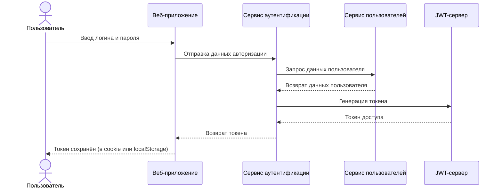
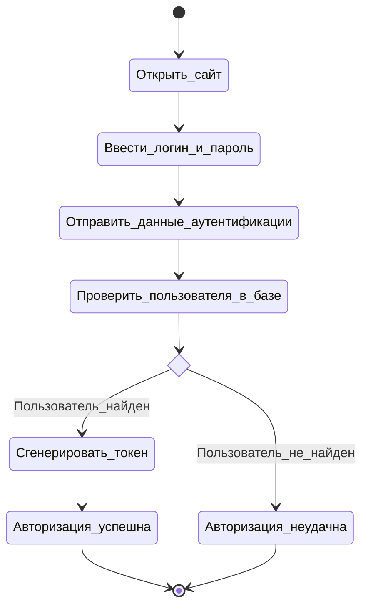
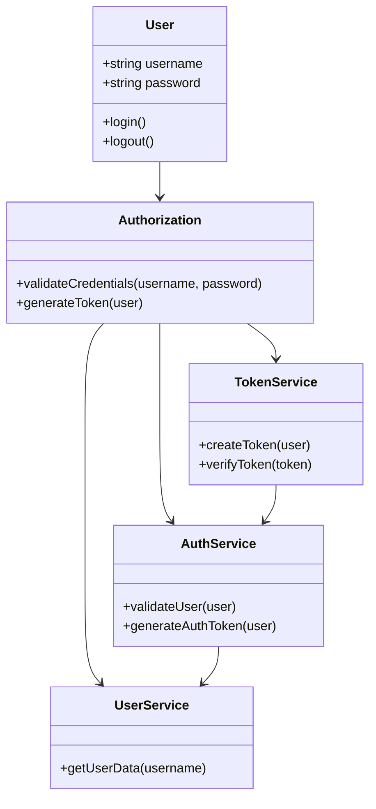

# Авторизация пользователя на сайте

Sequence Diagram (Диаграмма последовательности)

```mermaid
sequenceDiagram
    actor User as Пользователь
    participant Frontend as Веб-приложение
    participant AuthService as Сервис аутентификации
    participant UserService as Сервис пользователей
    participant JWT as JWT-сервер

    User ->> Frontend: Ввод логина и пароля
    Frontend ->> AuthService: Отправка данных авторизации
    AuthService ->> UserService: Запрос данных пользователя
    UserService -->> AuthService: Возврат данных пользователя
    AuthService ->> JWT: Генерация токена
    JWT -->> AuthService: Токен доступа
    AuthService -->> Frontend: Возврат токена
    Frontend -->> User: Токен сохранён (в cookie или localStorage)
```

Activity Diagram (Диаграмма активности)

  

```mermaid
stateDiagram-v2
    [*] --> Открыть_сайт
    Открыть_сайт --> Ввести_логин_и_пароль
    Ввести_логин_и_пароль --> Отправить_данные_аутентификации
    Отправить_данные_аутентификации --> Проверить_пользователя_в_базе
    
    state if_valid <<choice>>
    Проверить_пользователя_в_базе --> if_valid
    if_valid --> Сгенерировать_токен: Пользователь_найден
    if_valid --> Авторизация_неудачна: Пользователь_не_найден
    
    Сгенерировать_токен --> Авторизация_успешна
    Авторизация_успешна--> [*]
    
    Авторизация_неудачна --> [*]
```

Class Diagram (Диаграмма классов)

  

```mermaid
classDiagram
    class User {
        +string username
        +string password
        +login()
        +logout()
    }

    class Authorization {
        +validateCredentials(username, password)
        +generateToken(user)
    }

    class AuthService {
        +validateUser(user)
        +generateAuthToken(user)
    }

    class UserService {
        +getUserData(username)
    }

    class TokenService {
        +createToken(user)
        +verifyToken(token)
    }

    User --> Authorization
    Authorization --> AuthService
    Authorization --> TokenService
    Authorization --> UserService
    AuthService --> UserService
    TokenService --> AuthService
```

